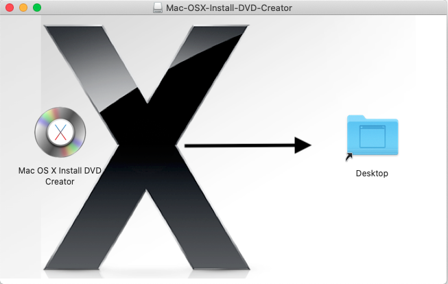
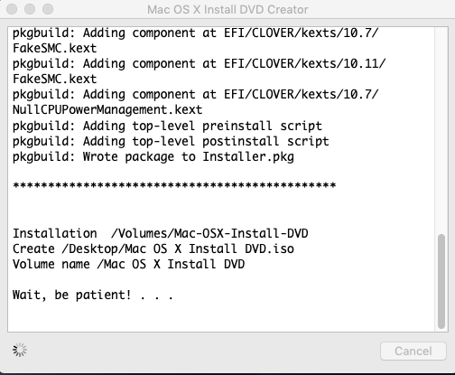
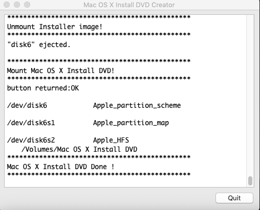
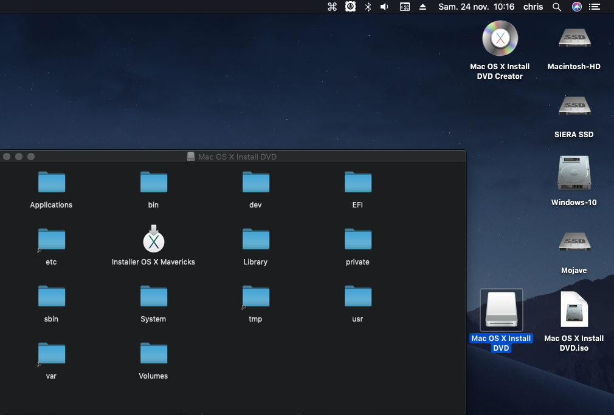

# Mac OS X Install DVD Creator
- This is to test macOS
- Buy a mac after testing macOS

This a app bundle create with Platypus-5.1
 
It work from 10.7 to 10.12
 
# Instructions

- This will create a Mac OS X Install DVD.iso on your Desktop

- The Bootloader Clover EFI v2.3k r3758 is automatically installed.

- You need Installer Mac OS X.app from Mac App Store on your Mac.

- You need DVD Double Layer 8.5 gig.

### [Download ➤ Mac OS X Install DVD Creator.dmg.rzip](https://github.com/chris1111/Mac-OSX-Install-DVD-Creator/releases/tag/V-1)
- Release 02 Dec 2018 using platypus 5.2
- Enable Dark Mode

### Exemple: Completed OS X Mavericks DVD create on macOS Mojave 10.14.1 (18B75)

 
